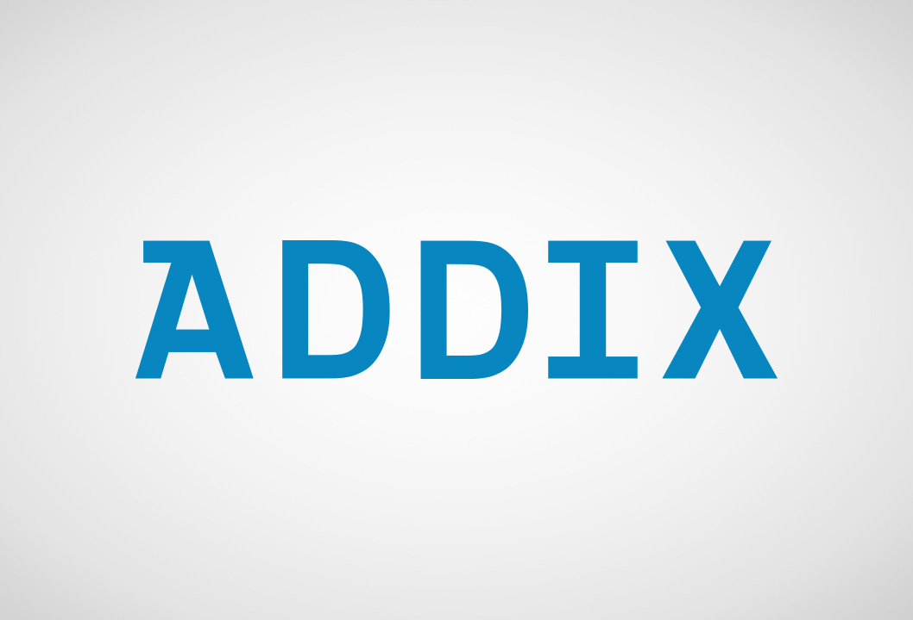

---
---

# MS Wavelab API

Initial suggestion for MQTT topics

```
ms-wavelab/

    guidance/
        ...

    navigation/
        xsens/                      # ...
            ...
        anschuetz/
            synapsis/               # ADDIX Multicast Box, Wavelab
            ...
        addix/
            ais/                    # ADDIX AIS, Nordhafen
            radio/
            ...
        ahoyrtc/
            mediaengine/
            ahoyonboard/
                google-pixel-jp/
            ...
        boening/
            AHD-DPS02/              # Navigation Signal Lights Control Monitoring
            ...
        torqeedo/
            ...
            
    control/
        request/
            ...
        command/
            ...
```

# Contributors

<a href="https://www.addix.net/">
    
</a>

<a href="https://www.uni-kiel.de/de/">
    
</a>
